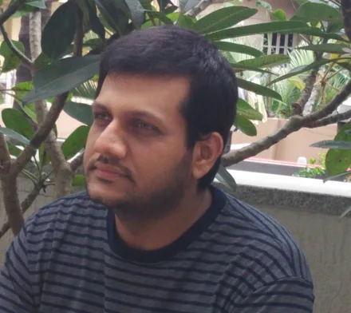
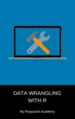
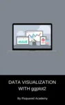
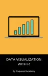
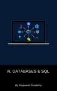
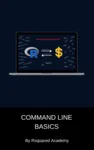

::: {.hero}
{.hero-photo alt="Aravind Hebbali"}
:::

I build statistical software that holds up outside a tutorial, and I help teams
do the same. My work sits where R, statistics, economics and finance overlap —
regression diagnostics, customer segmentation, descriptive and inferential
statistics, and the unglamorous plumbing that keeps an analysis reproducible
six months later when someone else has to rerun it.

Most of that work is open source. The package portfolio below is used far more
widely than I expected when I started writing it, and it is the reason people
find their way here: the packages are free, the vignettes are free, and there
is no upsell attached to any of it.

I also write. Six data science textbooks are free to read online, and I founded
[Rsquared Academy](https://www.rsquaredacademy.com/), an open-source education
platform for data science, where the courses behind those books live.

I earned my postgraduate degree from
[Madras School of Economics](https://www.mse.ac.in/) (Anna University),
Chennai, and now maintain the portfolio independently from Bengaluru, India.

::: {.social-row}
[LinkedIn](https://www.linkedin.com/in/aravind-hebbali-b6553831/) ·
[GitHub](https://github.com/aravindhebbali) ·
[hebbali.aravind@gmail.com](mailto:hebbali.aravind@gmail.com)
:::

## Explore {#explore}

::: {.explore-grid}

::: {.explore-card}
[Packages →](packages/){.explore-title}

Ten actively maintained packages on CRAN, from regression diagnostics to
customer segmentation. Reference docs and vignettes for each.
:::

::: {.explore-card}
[Apps →](apps/){.explore-title}

Shiny applications that ship inside the packages and run locally in R. No
install, no hosting, no account.
:::

::: {.explore-card}
[Books →](books/){.explore-title}

Six open textbooks on R, data wrangling, visualization, SQL and Bash.
:::

:::

## Open Source {#open-source}

Everything below is on CRAN, documented, and actively maintained. Each package
exists because I hit the problem myself and the existing options were either
too general or too abandoned.

| Package | What it does |
|:--------|:-------------|
| [olsrr](https://olsrr.rsquaredacademy.com) | Tools for building and interpreting OLS regression models: coefficient diagnostics, ANOVA tables, influential observation analysis and model comparison |
| [xplorerr](https://xplorerr.rsquaredacademy.com) | Interactive data exploration and visualization: correlation heatmaps, scatterplots, distribution checks and regression modelling from a point-and-click interface |
| [rfm](https://rfm.rsquaredacademy.com) | Recency, frequency and monetary value analysis for customer segmentation, from customer- or transaction-level data |
| [descriptr](https://descriptr.rsquaredacademy.com) | Fast descriptive statistics and frequency tables for numeric and categorical data |
| [blorr](https://blorr.rsquaredacademy.com) | Tools for developing binary logistic regression models, with model fit and validation measures |
| [rbin](https://github.com/rsquaredacademy/rbin) | Bin and group numeric data into intervals: equidistant, quantile and custom breaks |
| [vistributions](https://vistributions.rsquaredacademy.com) | Visualize probability distributions of univariate data, with statistical quality checks |
| [inferr](https://inferr.rsquaredacademy.com) | Hypothesis testing and inference: parametric and non-parametric tests with structured output |
| [yahoofinancer](https://github.com/rsquaredacademy/yahoofinancer) | Fetch stock and index data from Yahoo! Finance |
| [standby](https://github.com/rsquaredacademy/standby) | Save, load and manage R processes and sessions |

Reference documentation and vignettes for every package: [Packages](packages/).

## Books {#books}

Six open textbooks, free to read online. They started as blog posts, grew into
tutorials on [Rsquared Academy](https://www.rsquaredacademy.com/), and were
eventually rewritten into short books with the sharp edges filed off.

::: {.books}

::: {.book}
{alt="Cover: Introduction to R"}
[Introduction to R](https://intro-r.rsquaredacademy.com/){.book-title}
:::

::: {.book}
{alt="Cover: Data Wrangling with R"}
[Data Wrangling with R](https://wrangle-r.rsquaredacademy.com/){.book-title}
:::

::: {.book}
{alt="Cover: Data Visualization with ggplot2"}
[Data Visualization with ggplot2](https://viz-ggplot2.rsquaredacademy.com/){.book-title}
:::

::: {.book}
{alt="Cover: Data Visualization with Base R"}
[Data Visualization with Base R](https://viz-base.rsquaredacademy.com/){.book-title}
:::

::: {.book}
{alt="Cover: R and Relational Databases"}
[R and Relational Databases](https://rdbsql.rsquaredacademy.com/){.book-title}
:::

::: {.book}
{alt="Cover: Introduction to Bash"}
[Introduction to Bash](https://bash-intro.rsquaredacademy.com/){.book-title}
:::

:::

If you are starting from zero, begin with
[Introduction to R](https://intro-r.rsquaredacademy.com/). More on how these
were written: [Books](books/).

## Teaching {#teaching}

I run [Rsquared Academy](https://www.rsquaredacademy.com/), where the courses
behind the books are taught in full. It is an open-source education platform,
not a lead-generation funnel — the course material is written to be useful even
if you never sign up for anything.

- **For individuals.** Self-paced and live courses on R, the tidyverse,
  visualization, SQL and command-line tooling.
- **For teams.** Masterclasses built around your own data and problems, run as
  hands-on sessions rather than lectures.

## Consulting & Advisory {#consulting}

**Model validation and econometric audits.** Independent review of
specification, identification and inference — for teams who inherited a model
and need to know whether it is defensible. You get a written report, not just
a corrected script.

**Custom package development and architecture.** Internal R or Python tooling
built to survive handover: documented, tested, and structured so your team can
extend it without me. Most consulting work is undocumented code that one
person understands, and that is a single point of failure I can help remove.

**Team masterclasses.** Tidyverse, SQL, command-line tooling. Built around your
data, your conventions and your team's existing stack.

**Who this is for:** teams shipping quantitative work that other people have to
maintain. **Who it is not for:** one-off analyses, or anyone looking for a
pre-packaged answer.

::: {.cta}
[Schedule an intro call](https://calendly.com/aravindhebbali){.btn .btn-primary role="button"}
:::

## Elsewhere {#elsewhere}

- **[Blog](https://blog.rsquaredacademy.com/)** — essays on R, statistics and
  quantitative practice.
- **[GitHub](https://github.com/aravindhebbali)** — package sources, issues and
  discussions.
- **[Rsquared Academy](https://www.rsquaredacademy.com/)** — courses and the
  books above.
- **[Madras School of Economics](https://www.mse.ac.in/)** — where the
  statistical training started.