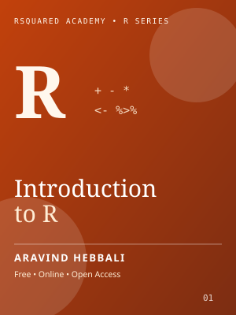
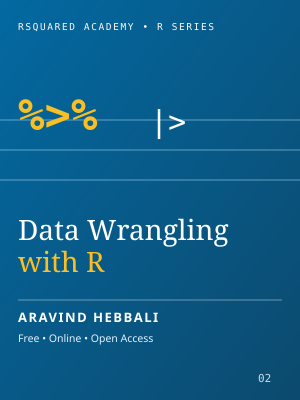
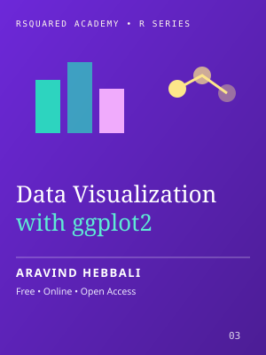
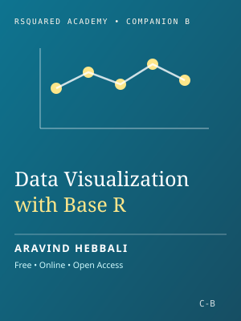
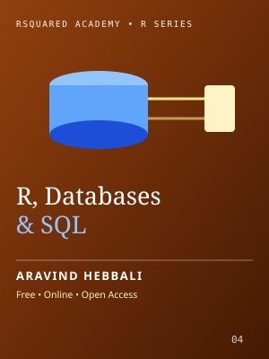
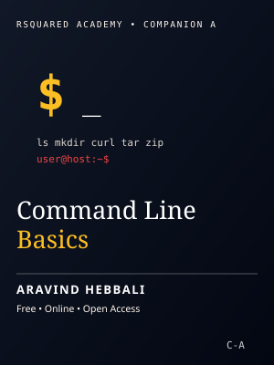

::: {.hero}
<!-- Intrinsic width/height on every image below: the browser reserves the
     box from the attributes instead of discovering it after decode, which is
     what drives the 4s of Style & Layout in the mobile trace. 440x392 is
     avatar.webp's true size. Deliberately NOT lazy-loaded - it is the hero
     and a prime LCP candidate, so it must not be deferred. -->
{.hero-photo width=440 height=392 alt="Aravind Hebbali"}
:::

I build statistical software that holds up outside a tutorial, and I help teams
do the same. My work sits where R, statistics, economics and finance overlap —
regression diagnostics, customer segmentation, descriptive and inferential
statistics, and the unglamorous plumbing that keeps an analysis reproducible
six months later when someone else has to rerun it.

Most of that work is open source. The package portfolio below is used far more
widely than I expected when I started writing it, and it is the reason people
find their way here: the packages are free, the vignettes are free, and there
is no upsell attached to any of it.

I also write. Six data science textbooks are free to read online, and I founded
[Rsquared Academy](https://www.rsquaredacademy.com/), an open-source education
platform for data science, where the courses behind those books live.

I earned my postgraduate degree from
[Madras School of Economics](https://www.mse.ac.in/) (Anna University),
Chennai, and now maintain the portfolio independently from Bengaluru, India.

## Explore {#explore}

::: {.explore-grid}

::: {.explore-card}
[<i class="bi bi-code"></i>Packages10 packages on CRAN &middot; reference docs and vignettes](packages/)
:::

::: {.explore-card}
[<i class="bi bi-window"></i>Apps7 Shiny apps &middot; run locally, no account](apps/)
:::

::: {.explore-card}
[<i class="bi bi-book"></i>Books6 open textbooks &middot; free to read online](books/)
:::

:::

## Open Source {#open-source}

These packages were written while teaching data science at
[Rsquared Academy](https://www.rsquaredacademy.com/). They are free to use and
were shared in the hope that others find them useful for teaching and learning
data science with R.

The goal is software which is:

- user friendly
- light weight
- well tested
- well documented

Major bugs get fixed quickly. Feature requests are considered but not promised.

::: {.lgrid .lgrid-h}

::: {.lcard .lcard-h}
::: {.lside}
{.lcover .lcover-hex width=360 height=417 alt="olsrr hex sticker"}

::: {.lactions}
[CRAN](https://cran.r-project.org/package=olsrr){.labtn}
[GitHub](https://github.com/aravindhebbali/olsrr){.labtn}
[Docs](https://olsrr.rsquaredacademy.com){.labtn}
:::
:::

::: {.lbody}

Regression

### [olsrr](https://olsrr.rsquaredacademy.com)

Tools for building linear regression models.

Diagnostics, variable selection and influence measures for a fitted <code>lm</code>.

What's inside

- Comprehensive Regression Output
- Variable Selection Procedures
- Heteroskedasticity Tests
- Collinearity Diagnostics
- Model Fit Assessment
- Measures of Influence
- Residual Diagnostics

:::
:::

::: {.lcard .lcard-h}
::: {.lside}
{.lcover .lcover-hex width=360 height=417 alt="xplorerr hex sticker"}

::: {.lactions}
[CRAN](https://cran.r-project.org/package=xplorerr){.labtn}
[GitHub](https://github.com/aravindhebbali/xplorerr){.labtn}
[Docs](https://xplorerr.rsquaredacademy.com){.labtn}
:::
:::

::: {.lbody}

Interactive

### [xplorerr](https://xplorerr.rsquaredacademy.com)

Tools for interactive data analysis.

Descriptive, inferential and visual analysis behind a Shiny interface. See <a href="apps/">Apps</a>.

What's inside

- Descriptive Statistics
- Inferential Statistics
- Visualize Probability Distributions
- Data Visualization
- RFM Analysis
- Linear Regression
- Logistic Regression

:::
:::

::: {.lcard .lcard-h}
::: {.lside}
{.lcover .lcover-hex width=360 height=417 alt="rfm hex sticker"}

::: {.lactions}
[CRAN](https://cran.r-project.org/package=rfm){.labtn}
[GitHub](https://github.com/rsquaredacademy/rfm){.labtn}
[Docs](https://rfm.rsquaredacademy.com){.labtn}
:::
:::

::: {.lbody}

Segmentation

### [rfm](https://rfm.rsquaredacademy.com)

Tools for RFM analysis.

Score and segment customers from transaction-level data. See <a href="apps/">Apps</a>.

What's inside

- Generate RFM Scores
- Handles Transaction / Customer Level Data
- Visualization Tools
- Segment Customers
- Includes Shiny App

:::
:::

::: {.lcard .lcard-h}
::: {.lside}
{.lcover .lcover-hex width=360 height=417 alt="descriptr hex sticker"}

::: {.lactions}
[CRAN](https://cran.r-project.org/package=descriptr){.labtn}
[GitHub](https://github.com/aravindhebbali/descriptr){.labtn}
[Docs](https://descriptr.rsquaredacademy.com){.labtn}
:::
:::

::: {.lbody}

Descriptive

### [descriptr](https://descriptr.rsquaredacademy.com)

Tools for generating descriptive and summary statistics.

The fastest way to screen a data frame before you model it.

What's inside

- Data Screening
- Summary Statistics
- Frequency Tables
- Cross Tables
- Data Visualization

:::
:::

::: {.lcard .lcard-h}
::: {.lside}
{.lcover .lcover-hex width=360 height=417 alt="rbin hex sticker"}

::: {.lactions}
[CRAN](https://cran.r-project.org/package=rbin){.labtn}
[GitHub](https://github.com/rsquaredacademy/rbin){.labtn}
[Docs](https://rbin.rsquaredacademy.com){.labtn}
:::
:::

::: {.lbody}

Wrangling

### [rbin](https://rbin.rsquaredacademy.com)

Tools for binning data.

Turn continuous variables into factors, and generate dummy variables from them.

What's inside

- Manual Binning
- Quantile Binning
- Winsorized Binning
- Equal Length Binning
- Equal Width Binning
- Factor Binning
- Generate Dummy Variables
- Includes RStudio Addins

:::
:::

::: {.lcard .lcard-h}
::: {.lside}
{.lcover .lcover-hex width=360 height=417 alt="blorr hex sticker"}

::: {.lactions}
[CRAN](https://cran.r-project.org/package=blorr){.labtn}
[GitHub](https://github.com/aravindhebbali/blorr){.labtn}
[Docs](https://blorr.rsquaredacademy.com){.labtn}
:::
:::

::: {.lbody}

Regression

### [blorr](https://blorr.rsquaredacademy.com)

Tools for building binary logistic regression models.

Model fit, validation and collinearity for a fitted <code>glm</code> with a binary outcome.

What's inside

- Bivariate Analysis
- Model Fit Statistics
- Model Validation
- Variable Selection
- Residual Diagnostics
- Collinearity Diagnostics
- Visualization

:::

:::

:::

Four more carry the long tail: [vistributions](https://cran.r-project.org/package=vistributions)
for visualizing probability distributions,
[inferr](https://cran.r-project.org/package=inferr) for inferential statistics,
[yahoofinancer](https://cran.r-project.org/package=yahoofinancer) for Yahoo!
Finance data, and [standby](https://cran.r-project.org/package=standby) for
managing R processes. [nse2r](https://github.com/rsquaredacademy/nse2r) is
archived and under revival. Full reference documentation and vignettes:
[Packages](packages/).

## Books {#books}

Six open textbooks, free to read online. They started as blog posts, grew into
tutorials on [Rsquared Academy](https://www.rsquaredacademy.com/), and were
eventually rewritten into short books with the sharp edges filed off.

::: {.lshelf}

::: {.lshelf-item}

01 Intro - Introduction to R
:::

::: {.lshelf-item}

02 Wrangle - Data Wrangling with R
:::

::: {.lshelf-item}

03 ggplot2 - Data Visualization with ggplot2
:::

::: {.lshelf-item}

04 Base - Data Visualization with Base R
:::

::: {.lshelf-item}

05 SQL - R, Databases and SQL
:::

::: {.lshelf-item}

06 Bash - Command Line Basics
:::

:::

If you are starting from zero, begin with
[Introduction to R](https://intro-r.rsquaredacademy.com/). Every title can also
be downloaded as a PDF or ePub: [Books](books/).

## Teaching {#teaching}

I run [Rsquared Academy](https://www.rsquaredacademy.com/), where the courses
behind the books are taught in full. It is an open-source education platform,
not a lead-generation funnel — the course material is written to be useful even
if you never sign up for anything.

- **For individuals.** Self-paced and live courses on R, the tidyverse,
  visualization, SQL and command-line tooling.
- **For teams.** Masterclasses built around your own data and problems, run as
  hands-on sessions rather than lectures.

## Consulting & Advisory {#consulting}

**Custom package development and architecture.** Internal R or Python tooling
built to survive handover: documented, tested, and structured so your team can
extend it without me. Most consulting work is undocumented code that one
person understands, and that is a single point of failure I can help remove.

**Team masterclasses.** Tidyverse, SQL, command-line tooling. Built around your
data, your conventions and your team's existing stack.

**Who this is for:** teams shipping quantitative work that other people have to
maintain. **Who it is not for:** one-off analyses, or anyone looking for a
pre-packaged answer.

::: {.cta}
[Schedule an intro call](https://calendly.com/aravindhebbali){.btn .btn-primary role="button"}
:::
