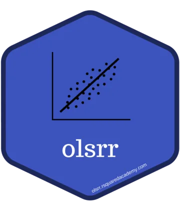
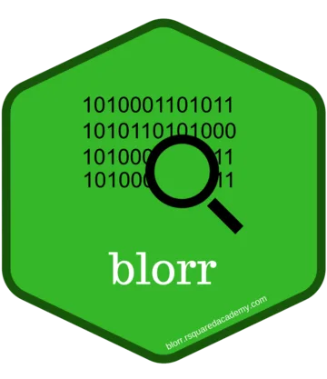
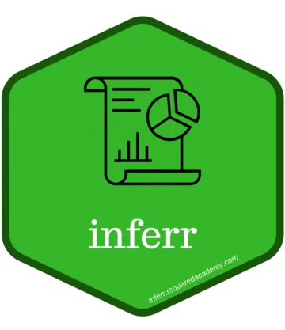
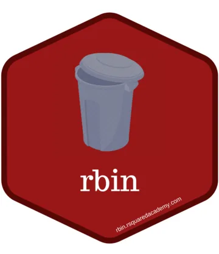

Ten packages, all on CRAN, all documented, all actively maintained. Each was
written while teaching at [Rsquared Academy](https://www.rsquaredacademy.com/)
and shared in the hope that others find them useful.

The goal is software which is user friendly, light weight, well tested and well
documented. Major bugs get fixed quickly; feature requests are considered but
not promised.

Full descriptions and vignettes: [pkgs.rsquaredacademy.com](https://pkgs.rsquaredacademy.com/).

## Regression and modelling {#regression}

::: {.lgrid .lgrid-h}

::: {.lcard .lcard-h}
::: {.lside}
{.lcover .lcover-hex alt="olsrr hex sticker"}

::: {.lactions}
[CRAN](https://cran.r-project.org/package=olsrr){.labtn}
[GitHub](https://github.com/aravindhebbali/olsrr){.labtn}
[Docs](https://olsrr.rsquaredacademy.com){.labtn}
:::
:::

::: {.lbody}

Flagship

### [olsrr](https://olsrr.rsquaredacademy.com)

Tools for building linear regression models.

Diagnostics, variable selection and influence measures for a fitted <code>lm</code>.

What's inside

- Comprehensive Regression Output
- Variable Selection Procedures
- Heteroskedasticity Tests
- Collinearity Diagnostics
- Model Fit Assessment
- Measures of Influence
- Residual Diagnostics

:::
:::

::: {.lcard .lcard-h}
::: {.lside}
{.lcover .lcover-hex alt="blorr hex sticker"}

::: {.lactions}
[CRAN](https://cran.r-project.org/package=blorr){.labtn}
[GitHub](https://github.com/aravindhebbali/blorr){.labtn}
[Docs](https://blorr.rsquaredacademy.com){.labtn}
:::
:::

::: {.lbody}

Flagship

### [blorr](https://blorr.rsquaredacademy.com)

Tools for building binary logistic regression models.

Model fit, validation and collinearity for a fitted <code>glm</code> with a binary outcome.

What's inside

- Bivariate Analysis
- Model Fit Statistics
- Model Validation
- Variable Selection
- Residual Diagnostics
- Collinearity Diagnostics
- Visualization

:::
:::

::: {.lcard .lcard-h}
::: {.lside}
{.lcover .lcover-hex alt="xplorerr hex sticker"}

::: {.lactions}
[CRAN](https://cran.r-project.org/package=xplorerr){.labtn}
[GitHub](https://github.com/aravindhebbali/xplorerr){.labtn}
[Docs](https://xplorerr.rsquaredacademy.com){.labtn}
:::
:::

::: {.lbody}

Flagship

### [xplorerr](https://xplorerr.rsquaredacademy.com)

Tools for interactive data analysis.

Descriptive, inferential and visual analysis behind a Shiny interface. See <a href="../apps/">Apps</a>.

What's inside

- Descriptive Statistics
- Inferential Statistics
- Visualize Probability Distributions
- Data Visualization
- RFM Analysis
- Linear Regression
- Logistic Regression

:::
:::

:::

## Descriptive and inferential statistics {#statistics}

::: {.lgrid .lgrid-h}

::: {.lcard .lcard-h}
::: {.lside}
{.lcover .lcover-hex alt="descriptr hex sticker"}

::: {.lactions}
[CRAN](https://cran.r-project.org/package=descriptr){.labtn}
[GitHub](https://github.com/aravindhebbali/descriptr){.labtn}
[Docs](https://descriptr.rsquaredacademy.com){.labtn}
:::
:::

::: {.lbody}

Flagship

### [descriptr](https://descriptr.rsquaredacademy.com)

Tools for generating descriptive and summary statistics.

The fastest way to screen a data frame before you model it.

What's inside

- Data Screening
- Summary Statistics
- Frequency Tables
- Cross Tables
- Data Visualization

:::
:::

::: {.lcard .lcard-h}
::: {.lside}
{.lcover .lcover-hex alt="inferr hex sticker"}

::: {.lactions}
[CRAN](https://cran.r-project.org/package=inferr){.labtn}
[GitHub](https://github.com/aravindhebbali/inferr){.labtn}
[Docs](https://inferr.rsquaredacademy.com){.labtn}
:::
:::

::: {.lbody}

Flagship

### [inferr](https://inferr.rsquaredacademy.com)

Tools for inferential statistics.

Hypothesis tests with plain R syntax — no formulas to memorise.

What's inside

- Binomial Test
- Test of Proportion
- t Test
- Chi Square Test
- Levene's Test
- Test of Variance
- McNemar Test
- Cochran Q Test
- Runs Test

:::
:::

::: {.lcard .lcard-h}
::: {.lside}
{.lcover .lcover-hex alt="vistributions hex sticker"}

::: {.lactions}
[CRAN](https://cran.r-project.org/package=vistributions){.labtn}
[GitHub](https://github.com/rsquaredacademy/vistributions){.labtn}
[Docs](https://vistributions.rsquaredacademy.com){.labtn}
:::
:::

::: {.lbody}

Flagship

### [vistributions](https://vistributions.rsquaredacademy.com)

Tools for visualizing probability distributions.

Plot the binomial, chi square, normal, F and t distributions. See <a href="../apps/">Apps</a>.

What's inside

- Binomial Distribution
- Chi Square Distribution
- Normal Distribution
- f Distribution
- t Distribution
- Includes Shiny App

:::
:::

:::

## Data wrangling and segmentation {#wrangling}

::: {.lgrid .lgrid-h}

::: {.lcard .lcard-h}
::: {.lside}
{.lcover .lcover-hex alt="rbin hex sticker"}

::: {.lactions}
[CRAN](https://cran.r-project.org/package=rbin){.labtn}
[GitHub](https://github.com/rsquaredacademy/rbin){.labtn}
[Docs](https://rbin.rsquaredacademy.com){.labtn}
:::
:::

::: {.lbody}

Flagship

### [rbin](https://rbin.rsquaredacademy.com)

Tools for binning data.

Turn continuous variables into factors, and generate dummy variables from them.

What's inside

- Manual Binning
- Quantile Binning
- Winsorized Binning
- Equal Length Binning
- Equal Width Binning
- Factor Binning
- Generate Dummy Variables
- Includes RStudio Addins

:::
:::

::: {.lcard .lcard-h}
::: {.lside}
{.lcover .lcover-hex alt="rfm hex sticker"}

::: {.lactions}
[CRAN](https://cran.r-project.org/package=rfm){.labtn}
[GitHub](https://github.com/rsquaredacademy/rfm){.labtn}
[Docs](https://rfm.rsquaredacademy.com){.labtn}
:::
:::

::: {.lbody}

Flagship

### [rfm](https://rfm.rsquaredacademy.com)

Tools for RFM analysis.

Score and segment customers from transaction-level data. See <a href="../apps/">Apps</a>.

What's inside

- Generate RFM Scores
- Handles Transaction / Customer Level Data
- Visualization Tools
- Segment Customers
- Includes Shiny App

:::
:::

:::

## Utilities {#utilities}

::: {.lgrid}

::: {.lcard}
::: {.lbody}
Utility

### [yahoofinancer](https://yahoofinancer.rsquaredacademy.com)

Fetch stock and index data from Yahoo! Finance.

::: {.lactions}
[CRAN](https://cran.r-project.org/package=yahoofinancer){.labtn}
[GitHub](https://github.com/rsquaredacademy/yahoofinancer){.labtn}
[Docs](https://yahoofinancer.rsquaredacademy.com){.labtn}
:::
:::

:::

::: {.lcard}
::: {.lbody}
Utility

### [standby](https://standby.rsquaredacademy.com)

Save, load and manage R processes and sessions.

::: {.lactions}
[CRAN](https://cran.r-project.org/package=standby){.labtn}
[GitHub](https://github.com/rsquaredacademy/standby){.labtn}
[Docs](https://standby.rsquaredacademy.com){.labtn}
:::
:::

:::

:::

## Archived {#archived}

::: {.lgrid}

::: {.lcard}
::: {.lbody}
Archived

### [nse2r](https://github.com/rsquaredacademy/nse2r)

Fetched data from the National Stock Exchange of India.

Archived 2023-08-07v0.1.6, under revival

No longer installable from CRAN. Source and issue tracker are on GitHub.

::: {.lactions}
[CRAN (archived)](https://cran.r-project.org/package=nse2r){.labtn}
[GitHub](https://github.com/rsquaredacademy/nse2r){.labtn .primary}
:::

:::

:::

:::
